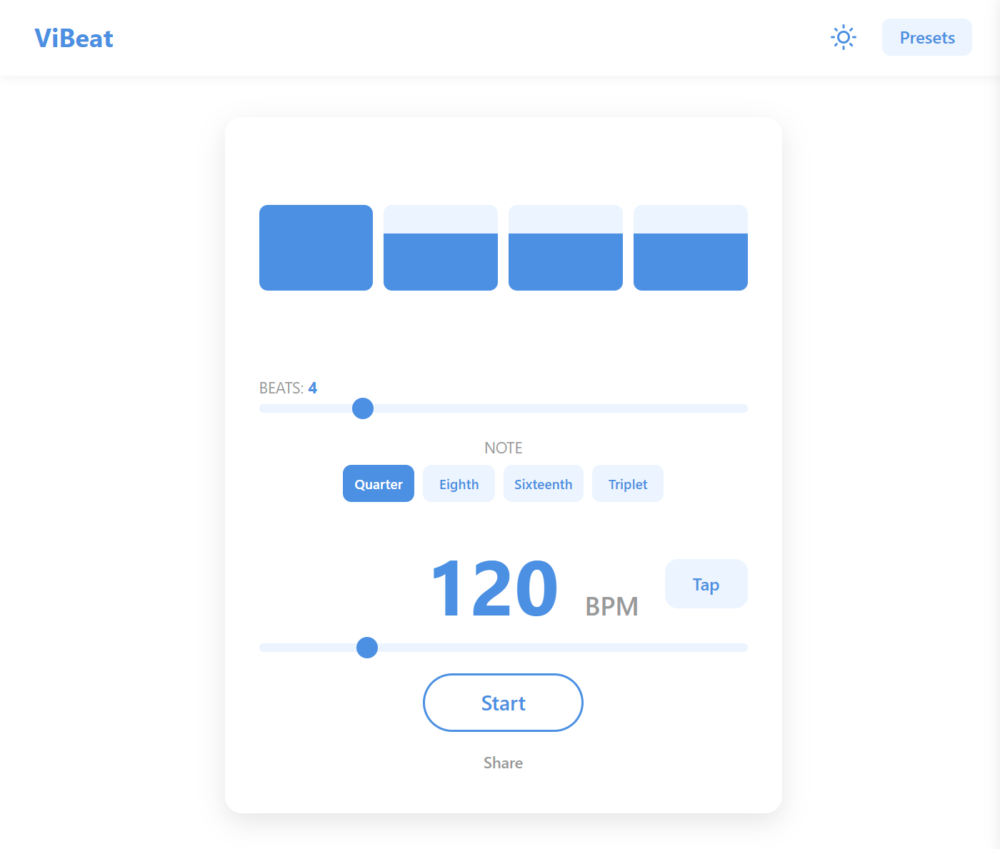

# 🎵 ViBeat

A sleek, modern, and feature-rich metronome built for the web. ViBeat is designed for musicians who need a precise, customizable, and user-friendly tool for their practice sessions.

**[➡️ View Live Demo](https://vibeat.nandemo.cv)**



---

### Key Features

- **High-Precision Engine:** Uses the Web Audio API for perfectly stable, drift-free timing.
- **Full Rhythm Control:** Customize BPM (20-500), beats per measure (1-16), note subdivisions, and individual beat accents.
- **Tap Tempo:** Quickly find the right tempo by tapping along to a rhythm.
- **Save & Load Presets:** Save your complete configurations to a sidebar for easy access.
- **Shareable Links:** Generate a unique URL to share your exact settings with others.
- **Modern UI:** A clean, responsive interface with beautiful **Light & Dark modes**.
- **Keyboard Shortcuts:** Control playback (`Space`) and tap tempo (`T`) without leaving your instrument.

### Tech Stack

Built with **React**, **Vite**, and **TypeScript**.

---

## 🚀 Getting Started

To get a local copy up and running, follow these simple steps.

1.  **Clone the repository:**

    ```sh
    git clone
    cd vibeat
    ```

2.  **Install NPM packages:**

    ```sh
    npm install
    ```

3.  **Start the development server:**
    ```sh
    npm run dev
    ```
    The app will be available at `http://localhost:5173`.

## ⚙️ Environment Variables

This project uses an environment variable for its cookie-less analytics. Create a `.env` file in the project root to configure it:

- `VITE_UMAMI_WEBSITE_ID`: Your unique website identifier from your Umami dashboard. This is required to track page views and events.

When deploying, remember to set this environment variable in your hosting provider's settings (e.g., on Vercel).
